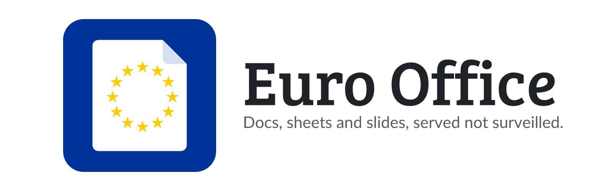

<picture>
  <source media="(prefers-color-scheme: dark)" srcset=".github/assets/banner-dark.png">
  
</picture>

<p align="center">
  <a href="https://github.com/junkerderprovinz/euro-office/actions/workflows/build.yml"></a>&nbsp;
  <a href="https://github.com/euro-office/documentserver"></a>&nbsp;
  <a href="https://github.com/junkerderprovinz/euro-office/pkgs/container/euro-office"></a>&nbsp;
  <a href="https://github.com/junkerderprovinz/opencloud"></a>&nbsp;
  <a href="https://unraid.net"></a>&nbsp;
  <a href="LICENSE"></a>
</p>

<p align="center">
A plug-and-play Unraid Community Applications template for <b>Euro Office</b>,
the sovereign European document server. It edits Word, Excel and PowerPoint
files (and their OpenDocument equivalents) in the browser and plugs straight
into <a href="https://github.com/junkerderprovinz/opencloud">OpenCloud</a> over
WOPI. Install from the Unraid <b>Apps</b> tab, set one shared secret, done.
</p>

<br>

<p align="center">
Maintained solo, in whatever spare time there is. Questions via the <a href="https://forums.unraid.net/topic/198811-support-junkerderprovinz-unraid-apps/">support thread</a>, bugs, ideas and feature requests via <a href="https://github.com/junkerderprovinz/unraid-apps/issues">GitHub issues</a>. If it's useful to you, a coffee is always welcome.
</p>

<p align="center">
  <a href="https://buymeacoffee.com/junkerderprovinz"></a>
  &nbsp;
  <a href="https://paypal.me/hallelujadesign"></a>
  &nbsp;
  <a href="https://junkerderprovinz.github.io/junkerderprovinz/"></a>
</p>

<br>

## Table of Contents

1. [What is this?](#1-what-is-this)
2. [Why this image exists](#2-why-this-image-exists)
3. [Features](#3-features)
4. [Quick Start on Unraid](#4-quick-start-on-unraid)
5. [Wiring it to OpenCloud](#5-wiring-it-to-opencloud)
6. [Configuration](#6-configuration)
7. [Updating](#7-updating)
8. [Troubleshooting](#8-troubleshooting)
9. [Contributing / License](#9-contributing--license)
10. [Support this project](#10-support-this-project)

<br>

## 1. What is this?

[Euro Office](https://github.com/euro-office/documentserver) is a sovereign,
European document server for browser-based editing of text documents,
spreadsheets and presentations. It is a maintained fork of the OnlyOffice
Document Server, so it speaks the same OnlyOffice and **WOPI** APIs and drops
straight into OpenCloud, Nextcloud or ownCloud.

This repository is **not a fork of Euro Office**. It builds a thin wrapper image
around the upstream
[`ghcr.io/euro-office/documentserver`](https://github.com/euro-office/documentserver/pkgs/container/documentserver),
adding exactly one thing: a small supervisor program that repairs the ownership
of the `Data` volume on boot. Section 2 explains why that is needed. The Unraid
template lives in
[unraid-apps](https://github.com/junkerderprovinz/unraid-apps/tree/main/euro-office)
and points at the wrapper image published here.

**This is not a standalone app.** It is the editor back-end for a file server.
On its own it only serves an internal welcome page. You point your cloud (the
[OpenCloud](https://github.com/junkerderprovinz/opencloud) container) at it, and
then edit files that live in that cloud.

<br>

## 2. Why this image exists

The upstream image ships with a real permission bug. The `chown -R ds:ds` step
that should hand ownership of the `Data` volume to the `ds` user, the account
every internal service actually runs as, is commented out in the vendor's own
build. On a freshly bind-mounted `Data` folder, which is exactly what Unraid
creates, the document server's admin panel and in some configurations editing
itself fail with a permission error.

This image adds one thing to the upstream image and nothing else: a small
supervisor program that re-asserts `Data`'s ownership during the first seconds
of boot, before the `ds-*` services start. `ENTRYPOINT` and the vendor's own
`entrypoint.sh` are untouched. See
[unraid-apps#7](https://github.com/junkerderprovinz/unraid-apps/issues/7) for
the report that turned this up.

<br>

## 3. Features

- ✅ Edits **.docx / .xlsx / .pptx** and **.odt / .ods / .odp** right in the browser
- ✅ **WOPI** protocol pre-enabled (`WOPI_ENABLED=true`), so OpenCloud can open and save documents
- ✅ One shared **JWT secret** signs every request between cloud and editor
- ✅ Sensible Unraid defaults: HTTP on a mapped port, optional persistence volumes, `--restart=unless-stopped`
- ✅ Reverse-proxy friendly, terminate TLS in front and hand the editor plain HTTP
- ✅ Bundles its own database and converter, no external services to run
- ✅ AGPL-3.0 wrapper, fork and adapt it under the same license

<br>

## 4. Quick Start on Unraid

This is a plug-and-play Community Applications template. No SSH, no config-file editing.

### Step 1: install from Apps

In the Unraid Web UI:

1. Go to the **Apps** tab.
2. Search for **`Euro Office`**.
3. Click **Install**.

### Step 2: set the JWT secret

The template's one required field is the **JWT secret**. Pick a long random
string and remember it, you will paste the *same* value into OpenCloud in the
next section. Leave **Enable WOPI** on `true`.

Hit **Apply**. First start pulls the image and warms up the bundled database
and converter, this takes a minute or two on the very first boot.

### Step 3: wait for the server to be ready

Open a shell and confirm the WOPI discovery endpoint answers with XML:

```bash
curl -s http://<unraid-ip>:9900/hosting/discovery | head -c 200
```

Once that returns an `<wopi-discovery>` document, the editor is ready. Then wire
it to OpenCloud (next section).

### Manual install (pre-CA-listing)

Until this repo is accepted into the Community Applications index, you can load
the template by hand. Run this once on the Unraid console or via SSH:

```bash
mkdir -p /boot/config/plugins/dockerMan/templates-user && \
curl -fsSL -o /boot/config/plugins/dockerMan/templates-user/my-Euro-Office.xml \
  https://raw.githubusercontent.com/junkerderprovinz/unraid-apps/main/euro-office/euro-office.xml
```

Then in the Unraid Web UI: **Docker** → **Add Container** → in the **Template**
dropdown, pick **Euro-Office** under *User templates*.

### Plain Docker (no Unraid)

```bash
docker run -d \
  --name euro-office \
  --restart unless-stopped \
  -p 9900:80 \
  -e WOPI_ENABLED=true \
  -e JWT_ENABLED=true \
  -e JWT_SECRET=change-me-to-a-long-random-string \
  ghcr.io/euro-office/documentserver:latest
```

<br>

## 5. Wiring it to OpenCloud

Euro Office is the editor; [OpenCloud](https://github.com/junkerderprovinz/opencloud)
is the cloud that stores your files. Connect them in the OpenCloud template:

| OpenCloud field | Value |
|---|---|
| **Web office suite** | `euro-office` |
| **Office document server URL** | `http://<euro-office-ip>:9900` (or your reverse-proxy https URL) |
| **Office WOPI secret** | the **same** string you set as the **JWT secret** here |

The two secrets **must be identical**, that is what lets the cloud and the
editor trust each other. After applying both containers, open a document in
OpenCloud, it now opens in Euro Office. OpenCloud uses Euro Office for Microsoft
formats by default and Collabora for OpenDocument, but Euro Office edits both.

> [!TIP]
> Behind the internet, put Euro Office behind a reverse proxy that terminates
> TLS (e.g. `https://office.example.com`) and use that https URL in OpenCloud.
> If OpenCloud itself uses a self-signed certificate, set **Allow self-signed
> upstream** = `true` on this container so the editor can fetch documents from it.

<br>

## 6. Configuration

| Variable | Default | Description |
|---|---|---|
| `JWT_SECRET` | *(required)* | Shared secret that signs cloud ↔ editor traffic. Must equal OpenCloud's *Office WOPI secret*. |
| `WOPI_ENABLED` | `true` | Enables the WOPI protocol OpenCloud uses. Keep `true`. |
| `JWT_ENABLED` | `true` | Require the signed JWT on every request. Keep `true`; only disable for isolated LAN testing. |
| `USE_UNAUTHORIZED_STORAGE` | `false` | Set `true` when the cloud serves a self-signed certificate. |

### Ports & Volumes

| Port | Purpose |  | Volume (optional) | Purpose |
|---|---|---|---|---|
| `80` → `9900` | Document server HTTP / WOPI |  | `/var/www/euro-office/Data` | Keys, fonts cache, forgotten files |
|  |  |  | `/var/log/euro-office` | Server logs, **leave unmounted**, see below |
|  |  |  | `/var/lib/postgresql` | Bundled database, **leave unmounted**, see below |

`Data` is optional: for a pure WOPI back-end the editor is effectively stateless
(your documents live in OpenCloud), mount it only to persist the internal cache
across restarts. It is empty inside the image, so a bind mount there hides
nothing.

**`Logs` and `Database` are different and default to unmounted on purpose.** The
image ships both directories pre-built, and a bind mount from an empty host
folder hides what is inside them, which stops the container from starting: over
`/var/log/euro-office` it hides the log tree nginx writes to, over
`/var/lib/postgresql` it hides the already-initialised database (see
[Troubleshooting](#8-troubleshooting) for both). Leave them blank unless the
folder already holds a copy of what the image put there. Clearing `Logs` costs
you nothing, the Unraid log button still shows everything the server prints.

<br>

## 7. Updating

On Unraid: **Docker** tab → click the container → **Force Update**. Euro Office
tracks the upstream `ghcr.io/euro-office/documentserver:latest` image. To pin a
specific version, set an explicit tag in the template's *Repository* field
(Advanced View).

<br>

## 8. Troubleshooting

<details>
<summary><b>Documents won't open in OpenCloud ("error finding app providers" / editor never loads)</b></summary>

- Confirm the discovery endpoint answers: `curl -s http://<ip>:9900/hosting/discovery | head` should return `<wopi-discovery>` XML. If it times out, the server is still starting, wait a minute after first boot.
- The **JWT secret** here and OpenCloud's **Office WOPI secret** must be byte-for-byte identical. A mismatch fails silently.
- Make sure OpenCloud's **Office document server URL** is reachable *from the OpenCloud container* (use the LAN IP or a resolvable proxy hostname, not `localhost`).
</details>

<details>
<summary><b>"Download failed" when saving, or the editor can't fetch the file</b></summary>

- If OpenCloud uses a self-signed certificate, set **Allow self-signed upstream** = `true` (`USE_UNAUTHORIZED_STORAGE=true`) on this container.
- If you front OpenCloud with a reverse proxy, make sure the URL you gave OpenCloud is the one the editor can actually reach.
</details>

<details>
<summary><b>First start is slow / high CPU right after boot</b></summary>

- Normal. The bundled database and converter warm up on the first start. It settles once `/hosting/discovery` returns XML, usually within a minute or two.
</details>

<details>
<summary><b>Container loops "PostgreSQL ... is not accessible or does not exist" and never starts</b></summary>

- The **Database** field (Advanced View) has a path in it. The image ships with an already-initialised database baked in; mounting a fresh empty folder over `/var/lib/postgresql` hides it, and the entrypoint has no way to initialise a database in an empty volume (upstream bug, no fix yet: [euro-office/documentserver#299](https://github.com/euro-office/documentserver/issues/299)).
- Fix: open the container's **Edit** page, switch on Advanced View, clear the **Database** field completely, then **Apply**. The container starts normally within a minute using the bundled database, which simply resets on the next recreate, fine for WOPI use with OpenCloud.
- Only fill in **Database** if that folder already contains a working euro-office Postgres data directory (for example one copied out of a running container first).
</details>

<details>
<summary><b>Container loops "Starting nginx nginx ...fail!" on a fresh install</b></summary>

- The **Logs** field (Advanced View) has a path in it. The image builds its log tree at `/var/log/euro-office/documentserver` (that is where `nginx.error.log` and one folder per service live), and the entrypoint never recreates it. Mounting a fresh empty folder over `/var/log/euro-office` hides the whole tree, so nginx aborts with `open() "/var/log/euro-office/documentserver/nginx.error.log" failed (2: No such file or directory)`. The entrypoint runs under `set -e`, so that one failure ends the boot and `--restart=unless-stopped` starts the same failure over again.
- Fix: open the container's **Edit** page, switch on Advanced View, clear the **Logs** field completely, then **Apply**. The container comes up within a minute and `/hosting/discovery` starts answering.
- You do not lose the logs: the Unraid log button on the container shows everything the server prints either way.
- Only fill in **Logs** if that folder already contains the log tree copied out of a running container first.
</details>

<br>

## 9. Contributing / License

Pull requests welcome. Issues:
<https://github.com/junkerderprovinz/euro-office/issues>.

**Licensing, dual:**

- This **wrapper** (Dockerfile, `chown-heal.sh`, `print-banner.sh`, Unraid template, README and banner/icon artwork) is licensed under the [GNU Affero General Public License v3.0](LICENSE) (AGPL-3.0).
- **Euro Office itself** is developed by the Euro Office project and retains its upstream license, see <https://github.com/euro-office/documentserver>. When you run, redistribute or rebuild the resulting container image, you must comply with **all** upstream licenses, not only with this wrapper's AGPL-3.0.

### Credits

- [**Euro Office**](https://github.com/euro-office/documentserver), the sovereign European document server
- [**OnlyOffice**](https://github.com/ONLYOFFICE/DocumentServer), the document server Euro Office builds on
- [**OpenCloud**](https://github.com/junkerderprovinz/opencloud), the cloud this editor pairs with
- [**Unraid Community Applications**](https://forums.unraid.net/forum/38-community-applications/), the best app store in self-hosting

<br>

## 10. Support this project

Questions? Check the [support thread](https://forums.unraid.net/topic/198811-support-junkerderprovinz-unraid-apps/). Bugs, ideas or feature requests? Please [open a GitHub issue](https://github.com/junkerderprovinz/unraid-apps/issues).

This is a one-person project. I put a lot of time and effort into building and maintaining it, in whatever free time I have. If it's helped you, I'd genuinely appreciate the support: you're welcome to buy me a coffee.

<p align="center">
  <a href="https://buymeacoffee.com/junkerderprovinz"></a>
  &nbsp;
  <a href="https://paypal.me/hallelujadesign"></a>
  &nbsp;
  <a href="https://junkerderprovinz.github.io/junkerderprovinz/"></a>
</p>
