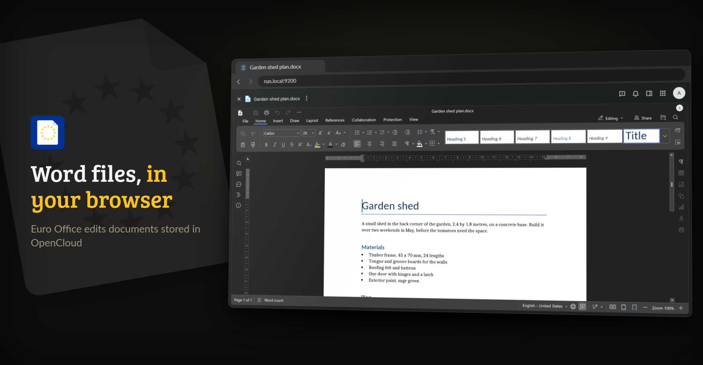
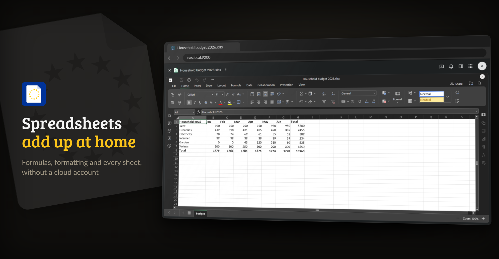
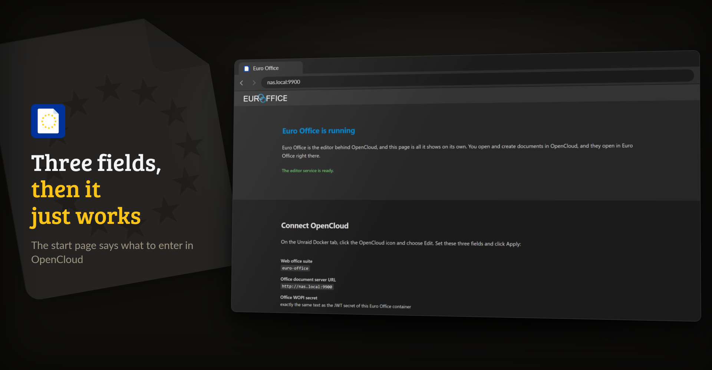

<picture>
  <source media="(prefers-color-scheme: dark)" srcset=".github/assets/banner-dark.png">
  
</picture>

<p align="center">
  <a href="https://github.com/junkerderprovinz/euro-office/actions/workflows/build.yml"></a>&nbsp;
  <a href="https://github.com/euro-office/documentserver"></a>&nbsp;
  <a href="https://github.com/junkerderprovinz/euro-office/pkgs/container/euro-office"></a>&nbsp;
  <a href="https://github.com/junkerderprovinz/opencloud"></a>&nbsp;
  <a href="https://ca.unraid.net/apps/euro-office-01m59u11rtj6n9"></a>&nbsp;
  <a href="LICENSE"></a>
</p>

<p align="center">
A plug-and-play Unraid Community Applications template for <b>Euro Office</b>,
the sovereign European document server. It edits Word, Excel and PowerPoint
files (and their OpenDocument equivalents) in the browser and plugs straight
into <a href="https://github.com/junkerderprovinz/opencloud">OpenCloud</a> over
WOPI. Install from the Unraid <b>Apps</b> tab, set one shared secret, done.
</p>

<!-- download-buttons: written by scripts/gen_download_buttons.py -->
<p align="center">
  <a href="https://ca.unraid.net/apps/euro-office-01m59u11rtj6n9"></a>
  &nbsp;
  <a href="https://github.com/junkerderprovinz/euro-office/pkgs/container/euro-office"></a>
  &nbsp;
  <a href="https://github.com/junkerderprovinz/euro-office/releases/latest"></a>
</p>
<!-- /download-buttons -->

<br>

<p align="center">
A one-knight job: I build it, keep it running, work through the issues and add what people ask for, until nothing is missing. It is free, with no accounts, no telemetry, no ads and no paid tier. No asterisk anywhere. Nothing readable ever leaves your own walls. Forged on evenings and weekends, with heart and stubbornness.
</p>

<p align="center">
If it has earned a place on your server or computer, toss a coin to your knight: it helps cover the costs and keeps the project alive. It also makes this knight's heart beat a little faster. Three ways below, whichever suits you.
</p>

<!-- give-buttons: written by scripts/gen_download_buttons.py -->
<p align="center">
  <a href="https://buymeacoffee.com/junkerderprovinz"></a>
  &nbsp;
  <a href="https://www.paypal.com/donate/?hosted_button_id=76FVV52TKXTUS"></a>
  &nbsp;
  <a href="https://junkerderprovinz.github.io/junkerderprovinz/"></a>
</p>
<!-- /give-buttons -->

<br>

## Table of Contents

1. [What it looks like](#1-what-it-looks-like)
2. [What it does](#2-what-it-does)
3. [Getting started](#3-getting-started)
4. [How AI is used here](#4-how-ai-is-used-here)
5. [Support this project](#5-support-this-project)

<br>

## 1. What it looks like

The documents in these pictures are made up.

<p align="center">
  
  <br><em>A Word file from OpenCloud, open in Euro Office in the same tab</em>
</p>

<p align="center">
  
  <br><em>Spreadsheets with their formulas, edited where they are stored</em>
</p>

<p align="center">
  
  <br><em>The start page shows whether the editor is ready and what to enter in OpenCloud</em>
</p>

<br>

## 2. What it does

[Euro Office](https://github.com/euro-office/documentserver) is a European fork of the OnlyOffice Document Server. It edits Word, Excel and PowerPoint files and their OpenDocument counterparts in the browser, and it speaks the OnlyOffice and WOPI APIs, so OpenCloud, Nextcloud and ownCloud can use it. It is the editor behind a file server, not an app of its own. This image is the upstream [`ghcr.io/euro-office/documentserver`](https://github.com/euro-office/documentserver/pkgs/container/documentserver) with four additions:

- **It repairs the `Data` folder.** The upstream build leaves out the step that hands `Data` to the user its services run as, so on a fresh Unraid folder the admin panel, and sometimes editing, fail with a permission error. A small program fixes the ownership in the first seconds of every start. The report that found it is [unraid-apps#7](https://github.com/junkerderprovinz/unraid-apps/issues/7).
- **It runs under OpenCloud's address.** The [OpenCloud](https://github.com/junkerderprovinz/opencloud) container passes the editor through at `/euro-office/`, and this image strips that prefix again. The browser only talks to OpenCloud, so plain http between the two containers is fine, there is no certificate to accept, and only OpenCloud has to be reachable from outside.
- **It serves https for other clouds.** Nextcloud and ownCloud load the editor straight from Euro Office, so the image makes a self-signed certificate on the first start, or uses yours. The http port keeps serving the editor instead of redirecting to the Unraid web UI.
- **Its start page helps.** It replaces the vendor's page and says whether the editor is ready and which three fields to set in OpenCloud.

<br>

## 3. Getting started

1. Install **Euro Office** from [Community Applications](https://ca.unraid.net/apps/euro-office-01m59u11rtj6n9), set a long random **JWT secret** and click **Apply**. The first start takes a minute or two.
2. Open the WebUI at `http://<server-ip>:9900`. The start page says when the editor is ready.
3. In the OpenCloud template, set these three fields and apply:

| OpenCloud field | Value |
|---|---|
| **Web office suite** | `euro-office` |
| **Office document server URL** | `http://<server-ip>:9900`, the address the WebUI button opens |
| **Office WOPI secret** | the same text as the **JWT secret** here |

The **New** button in OpenCloud then offers documents, spreadsheets and presentations, and Office files open in Euro Office. This needs the OpenCloud container 1.4.0 or later. An older one loads the editor straight from Euro Office and needs its https address, `https://<server-ip>:9943`.

Without Unraid:

```bash
docker run -d --name euro-office \
  -p 9900:80 \
  -e WOPI_ENABLED=true \
  -e JWT_ENABLED=true \
  -e JWT_SECRET=change-me-to-a-long-random-string \
  -e USE_UNAUTHORIZED_STORAGE=true \
  --restart unless-stopped \
  ghcr.io/junkerderprovinz/euro-office:latest
```

Nextcloud and ownCloud need the https port as well (`-p 9943:443`, **HTTPS Port** under Advanced View in the template). Accept its certificate once on every device, or put a certificate your browsers trust in the **Certificates** folder and fill in **TLS certificate** and **TLS private key**. Leave **Logs** and **Database** empty: an empty folder mounted there hides what the image ships, and the container cannot start.

<br>

## 4. How AI is used here

One knight builds this, and AI is one of the tools I work with, the same way I work with an editor or a compiler. It helps me write code and documentation and it checks my work, and that saves me a good many evenings. It does not make the decisions, though. I read and understand everything before it ships, and if something here breaks, that is on me and not on the tool.

You do not have to take my word for it. The code is open and every release note is written by hand. The issue tracker shows how problems actually get handled, including the ones I got wrong the first time. If you find something that is not right, open an issue and I will look at it.

<br>

## 5. Support this project

Questions? Check the [support thread](https://forums.unraid.net/topic/198811-support-junkerderprovinz-unraid-apps/). Bugs, ideas or feature requests? Please [open a GitHub issue](https://github.com/junkerderprovinz/unraid-apps/issues).

A one-knight job: I build it, keep it running, work through the issues and add what people ask for, until nothing is missing. It is free, with no accounts, no telemetry, no ads and no paid tier. No asterisk anywhere. Nothing readable ever leaves your own walls. Forged on evenings and weekends, with heart and stubbornness.

If it has earned a place on your server or computer, toss a coin to your knight: it helps cover the costs and keeps the project alive. It also makes this knight's heart beat a little faster. Three ways below, whichever suits you.

<!-- give-buttons: written by scripts/gen_download_buttons.py -->
<p align="center">
  <a href="https://buymeacoffee.com/junkerderprovinz"></a>
  &nbsp;
  <a href="https://www.paypal.com/donate/?hosted_button_id=76FVV52TKXTUS"></a>
  &nbsp;
  <a href="https://junkerderprovinz.github.io/junkerderprovinz/"></a>
</p>
<!-- /give-buttons -->

<br>

<sub>The AGPL-3.0 covers this wrapper only. Euro Office is developed by the Euro Office project under its own licence (see [euro-office/documentserver](https://github.com/euro-office/documentserver)), and running or redistributing the image means following every upstream licence.</sub>
